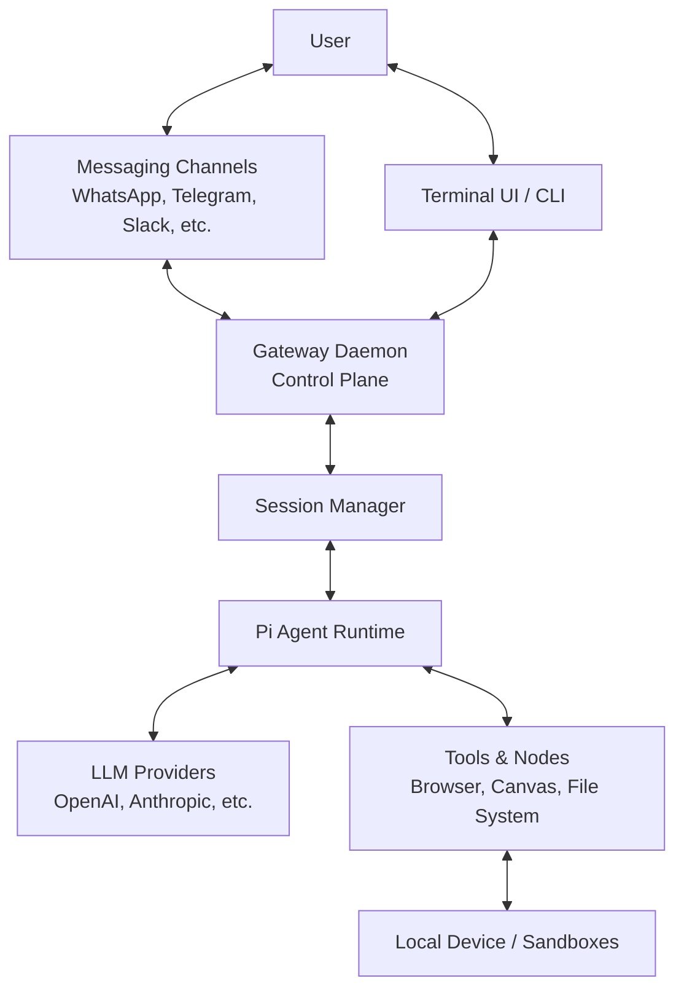

# OpenClaw Architecture Report

Date: March 22, 2026

## Core Components

- **CLI/Library Entry (`src/index.ts`)**: Initializes OpenClaw either as a library or a CLI application.
- **Gateway Daemon (`src/daemon`)**: Background service managing connections, sessions, and events.
- **Agents Runtime (`src/agents`)**: Wraps Pi Agent core for executing tasks and interacting with models.
- **Messaging Channels (`src/channels`)**: Integrations with WhatsApp, Telegram, Discord, Slack, etc.
- **Terminal UI (`src/tui`)**: Interactive terminal interface for managing the assistant.

## High-Level Architecture Flowchart



## Potential Bugs & Code Issues

Based on static analysis, the following areas need attention:

1. **src/agents/compaction.ts:25**: `  "- TODOs, open questions, and constraints",`
1. **src/agents/pi-embedded-runner/compact.ts:918**: `        // TODO(#7175): Consider exposing full message snapshots or pre-compaction injection`
1. **src/agents/pi-embedded-runner/compact.ts:1057**: `        // TODO(#9611): Consider exposing compaction summaries or post-compaction injection;`
1. **src/agents/pi-extensions/compaction-safeguard.ts:60**: `  "## Open TODOs",`
1. **src/agents/pi-extensions/compaction-safeguard.ts:570**: `    "## Open TODOs",`
1. **src/agents/pi-extensions/compaction-safeguard.test.ts:830**: `      "## Open TODOs",`
1. **src/agents/pi-extensions/compaction-safeguard.test.ts:898**: `        "## Open TODOs",`
1. **src/agents/pi-extensions/compaction-safeguard.test.ts:920**: `        "## Open TODOs",`
1. **src/agents/pi-extensions/compaction-safeguard.test.ts:942**: `        "## Open TODOs",`
1. **src/agents/pi-extensions/compaction-safeguard.test.ts:964**: `        "## Open TODOs",`

## Suggested Code Fixes

### 1. Compaction Safeguard Extension (`src/agents/pi-extensions/compaction-safeguard.ts`)
- **Issue**: Missing or incomplete handling of 'Open TODOs' section during compaction as flagged by multiple TODOs in tests.
- **Fix Idea**: Implement a proper extraction regex or parser for '## Open TODOs' that preserves state between memory compactions.
```typescript
// Suggested approach for extraction:
const extractTodos = (transcript: string): string[] => {
  const match = transcript.match(/## Open TODOs\n([\s\S]*?)(?:##|$)/);
  return match ? match[1].split('\n').filter(l => l.trim().startsWith('-')) : [];
};
```

### 2. General Architecture Improvements
- **Issue**: The `src/` directory is massive (150+ directories, 4800+ files).
- **Fix Idea**: Implement a proper monorepo structure utilizing the existing `pnpm-workspace.yaml`. Move independent modules (like specific channels or tools) into separate packages in `packages/` to reduce build times and improve test isolation.
